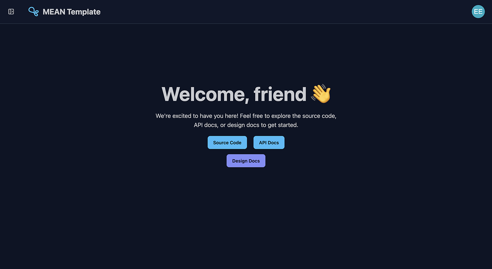
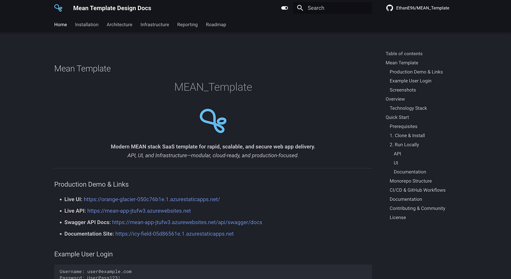

---
hide:
  - navigation
---

## Mean Template

<p align="center">
    <h1 style="text-align: center;">MEAN_Template</h1>
</p>

<p align="center">
   
</p>

<p align="center">
   <b>Modern MEAN stack SaaS template for rapid, scalable, and secure web app delivery.</b><br>
   <i>API, UI, and Infrastructure—modular, cloud-ready, and production-focused.</i>
</p>

---

### Production Demo & Links

- **Live UI:** [https://orange-glacier-050c76b1e.1.azurestaticapps.net/](https://orange-glacier-050c76b1e.1.azurestaticapps.net/)
- **Live API:** [https://mean-app-jtufw3.azurewebsites.net](https://mean-app-jtufw3.azurewebsites.net/api/health)
- **Swagger API Docs:** [https://mean-app-jtufw3.azurewebsites.net/api/swagger/docs](https://mean-app-jtufw3.azurewebsites.net/api/swagger/docs)
- **Documentation Site:** [https://icy-field-05d86561e.1.azurestaticapps.net](https://icy-field-05d86561e.1.azurestaticapps.net)

### Example User Login

```
Username: user@example.com
Password: UserPass123!
```

---

### Screenshots

<!--
Add screenshots of the UI, API docs, or dashboards below. Example:
-->
<div align="center">

**Landing Page**


</div>

<div align="center">

**App Page**



</div>

<div align="center">

**Design Docs Page**



</div>

<!-- Add more screenshots as needed -->

---

# Overview

**MEAN_Template** is a monorepo boilerplate for SaaS and web applications, optimized for:

- **API-first development** (Node.js, TypeScript, Express, MongoDB)
- **Modern Angular UI** (Angular 19, Tailwind, DaisyUI)
- **Azure-native infrastructure** (ARM templates, CI/CD, Docker)
- **Separation of concerns**: API, UI, and Infra are independently developed, tested, and deployed

> **Why?**
>
> - Ship new SaaS products faster with a secure, scalable, and opinionated foundation
> - Focus on your business logic, not boilerplate
> - Built for real-world cloud deployments, not just local demos

---

## Technology Stack

**Backend (API):**

- Node.js, TypeScript, Express
- MongoDB (Mongoose)
- Passport (GitHub, Google, Local)
- Application Insights, Swagger

**Frontend (UI):**

- Angular 19
- Tailwind CSS, DaisyUI

**Infrastructure:**

- Azure ARM templates (modular, sequenced)
- Docker, Docker Compose
- GitHub Actions (CI/CD)

---

# Quick Start

## Prerequisites

- Node.js 20+
- NPM 9+
- MongoDB (local or Azure CosmosDB)
- Azure account (for cloud deployment)

## Clone & Install

```bash
git clone https://github.com/EthanE96/MEAN_Template.git
cd MEAN_Template
# Install API dependencies
cd api && npm i
# Install UI dependencies
cd ../ui && npm i
```

## Run Locally

### API

```bash
cd api
npm run watch
# or: npm run docker:up (for Docker Compose)
# API: http://localhost:3000/api
```

### UI

```bash
cd ui
npm run watch
# or: npm run start
# UI: http://localhost:4200/
```

### Documentation

```bash
cd docs
mkdocs serve
# Docs: http://127.0.0.1:8000
```

---

## Monorepo Structure

| Folder   | Description                                             |
| -------- | ------------------------------------------------------- |
| `api/`   | Node.js/TypeScript API, Passport, MongoDB               |
| `ui/`    | Angular SPA, Tailwind, DaisyUI                          |
| `infra/` | Azure ARM templates, deployment scripts, Docker compose |
| `docs/`  | MkDocs documentation site                               |

---

## CI/CD & GitHub Workflows

- **API:** Docker image built & published to GHCR on push/tag ([api-build-container.yml](.github/workflows/api-build-container.yml))
- **UI:** Deployed to Azure Static Web Apps on push/PR ([azure-static-web-apps-orange-glacier-050c76b1e.yml](.github/workflows/azure-static-web-apps-orange-glacier-050c76b1e.yml))
- **Docs:** Auto-deployed to Azure Static Web Apps ([azure-static-web-apps-icy-field-05d86561e.yml](.github/workflows/azure-static-web-apps-icy-field-05d86561e.yml))
- **Infra:** ARM templates deployed via GitHub Actions ([arm-deployment.yml](.github/workflows/arm-deployment.yml))

---

## Documentation

- [Architecture](/architecture)
- [Installation](/installation)
- [Infrastructure](/infrastructure)
- [Reporting](/reporting)
- [Roadmap](/roadmap)

---

## Contributing & Community

Contributions, issues, and feature requests are welcome! Please open an issue or PR.

---

## License

MIT License

Copyright 2025 Ethan Edwards

Permission is hereby granted, free of charge, to any person obtaining a copy
of this software and associated documentation files (the “Software”), to deal
in the Software without restriction, including without limitation the rights
to use, copy, modify, merge, publish, distribute, sublicense, and/or sell
copies of the Software, and to permit persons to whom the Software is
furnished to do so, subject to the following conditions:

The above copyright notice and this permission notice shall be included in all
copies or substantial portions of the Software.

THE SOFTWARE IS PROVIDED “AS IS”, WITHOUT WARRANTY OF ANY KIND, EXPRESS OR
IMPLIED, INCLUDING BUT NOT LIMITED TO THE WARRANTIES OF MERCHANTABILITY,
FITNESS FOR A PARTICULAR PURPOSE AND NONINFRINGEMENT. IN NO EVENT SHALL THE
AUTHORS OR COPYRIGHT HOLDERS BE LIABLE FOR ANY CLAIM, DAMAGES OR OTHER
LIABILITY, WHETHER IN AN ACTION OF CONTRACT, TORT OR OTHERWISE, ARISING FROM,
OUT OF OR IN CONNECTION WITH THE SOFTWARE OR THE USE OR OTHER DEALINGS IN THE
SOFTWARE.

---
